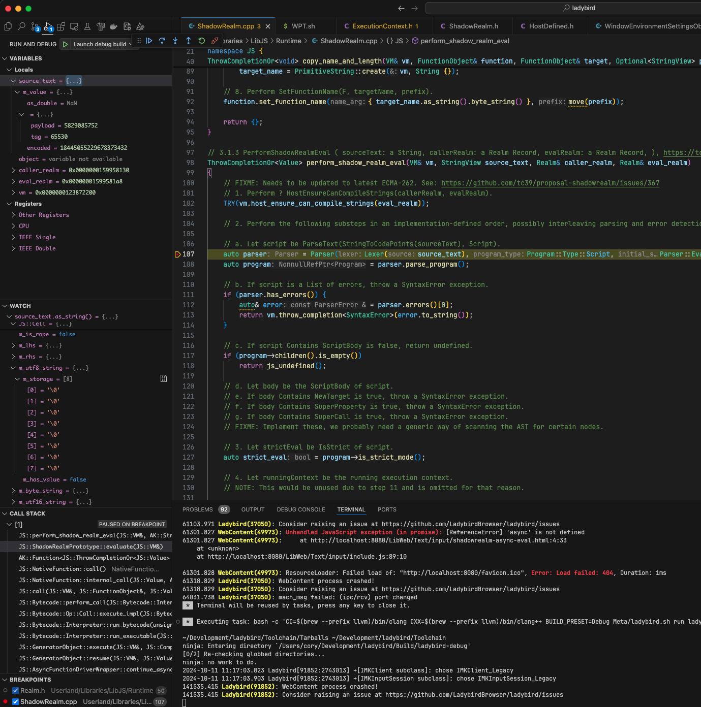
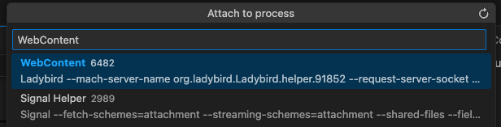
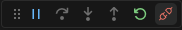

# Debugging with Visual Studio Code

Visual Studio Code's built in debugging UI simplifies the debugging process for many who are not familiar with gdb or who prefer to work completely within their IDE.

Here's what it looks like when it's all set up.




## Steps

1. [Build and launch the debug build of the browser](#Debug-Task)
1. [Attach the VSCode debugger to one of the browser's child processes](#Attach-and-Debug)
1. [Detach once finished debugging](#Detach)

### Debug Task

Update your `.vscode/tasks.json` config to include the following "launch debug" task. This will build Ladybird using the `BUILD_PRESET=Debug` option and launch the browser. Once the browser is running, you can then run the "Attach and debug" launch command described below.

<details>
<summary>.vscode/tasks.json</summary>

```json
{
    "version": "2.0.0",
    "tasks": [
        {
            "label": "launch debug",
            "type": "shell",
            "command": "bash",
            "args": [
                "-c",
                // Update this to use your system's run command. 
                // Default:
                //   BUILD_PRESET=Debug Meta/ladybird.sh run ladybird
                // MacOS with Homebrew clang:
                //   CC=$(brew --prefix llvm)/bin/clang CXX=$(brew --prefix llvm)/bin/clang++ BUILD_PRESET=Debug Meta/ladybird.sh run ladybird
                "CC=$(brew --prefix llvm)/bin/clang CXX=$(brew --prefix llvm)/bin/clang++ BUILD_PRESET=Debug Meta/ladybird.sh run ladybird"
            ],
            "options": {
                "env": {
                    // Put your custom run configuration here
                }
            },
            "problemMatcher": [
                {
                    "base": "$gcc",
                    "fileLocation": [
                        "relative",
                        "${workspaceFolder}/Build/ladybird-debug"
                    ]
                },
                {
                    "source": "gcc",
                    "fileLocation": [
                        "relative",
                        "${workspaceFolder}/Build/ladybird-debug"
                    ],
                    "pattern": [
                        {
                            "regexp": "^([^\\s]*\\.S):(\\d*): (.*)$",
                            "file": 1,
                            "location": 2,
                            "message": 3
                        }
                    ]
                },
                {
                    "source": "Assertion Failed",
                    "owner": "cpp",
                    "pattern": [
                        {
                            "regexp": "ASSERTION FAILED: (.*)$",
                            "message": 1
                        },
                        {
                            "regexp": "^((?:.*)\\.(h|cpp|c|S)):(\\d*)$",
                            "file": 1,
                            "location": 3
                        }
                    ],
                    "fileLocation": [
                        "relative",
                        "${workspaceFolder}/Build/ladybird-debug"
                    ]
                }
            ]
        }
    ]
}

```
</details>


### Attach and Debug

Once a debug build of the browser is running, you will want to attach the VSCode debugger to it. Use the following launch command.

**Note:** Be sure to update the "program" field to point to the debug binary for your system.

Once the command is run, a VSCode window will pop up showing the running processes to select from. Select a Ladybird process to begin debugging. Add breakpoints in order to suspend execution at the location you're interested in.



<details>
<summary>.vscode/launch.json</summary>

```json
{
  "version": "2.0.0",
  "configurations": [
    {
      "name": "Attach and debug",
      "type": "cppdbg",
      "request": "attach",
      // Note: this is MacOS specific, update to point to your *debug* binary
      "program": "${workspaceRoot}/Build/ladybird-debug/bin/Ladybird.app/Contents/MacOS/Ladybird",
      // Note: this is potentially MacOS specific, update to either "gdb" or "lldb"
      // more info: https://code.visualstudio.com/docs/cpp/launch-json-reference#_mimode
      "MIMode": "lldb",
    },
  ]
}

```
</details>

### Detach

After you're finished debugging, detach the VSCode debugger from the running process. Use the Disconnect button from the debugging commands UI.



## Troubleshooting

### I can step through frames but I don't see local variables

This is most likely due to not building using `BUILD_PRESET=Debug` when running `./Meta/ladybird.sh`.
