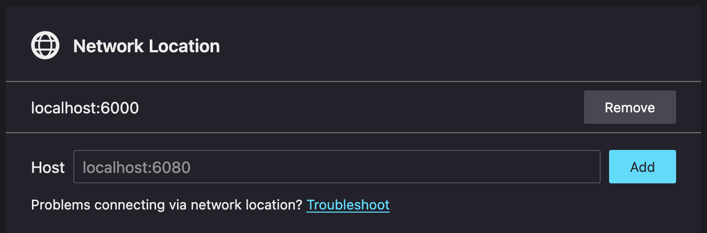
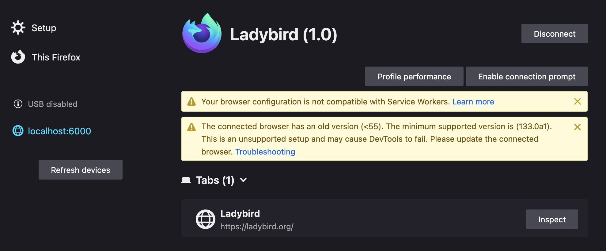
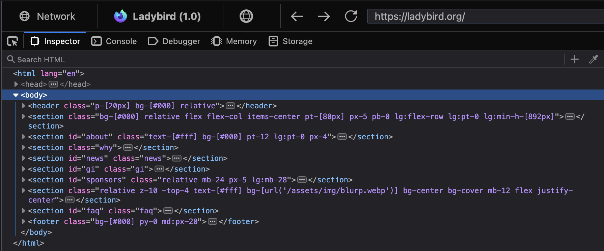

# Firefox DevTools Integration

Ladybird contains an experimental, work-in-progress DevTools server. This document describes how to use the server and
the protocol used to communicate with the DevTools client.

## Using DevTools

The DevTools server may be enabled with the `--devtools` command line flag when launching Ladybird. This flag expects a
port for the DevTools server to listen on. For example:

```bash
./Meta/ladybird.sh run ladybird --devtools 6000 https://ladybird.org/
```

Once the browser is running, in Firefox, navigate to `about:debugging` and select the "Setup" tab. In the
"Network Location" form, enter the DevTools server address. In the above example, this will be `localhost:6000`. You
will only have to enter this information once:



This will make the address appear on the left-side of the page. Click "Connect":


Once connected, the listed address will now be clickable itself. Click it to be brought to a page which shows Ladybird's
tab list:



Click the "Inspect" button next to the tab you wish to debug. This will open another tab in Firefox with an inspector
panel, which you may use to view the DOM tree:



## DevTools protocol

Firefox's documentation of its [DevTools protocol](https://firefox-source-docs.mozilla.org/devtools/backend/protocol.html)
is quite incomplete, and even incorrect in some places. To aid with development, this section describes the protocol that
Ladybird has implemented. Note that this is only observed behavior - our implementation could certainly be incorrect or
incomplete in places.

The protocol itself is based on ["actors"](https://firefox-source-docs.mozilla.org/devtools/backend/protocol.html#actors).
Each packet contains a JSON object. Messages sent from the DevTools client contain a `"to"` field indicating the actor
for which the message is intended. Messages sent from the DevTools server contain a `"from"` field indicating the actor
from which the message originated.

A very important aspect of this protocol is that the client may send multiple requests to an actor at once without
waiting for a reply, to which the actor must then reply in order. Any requests that must be performed asynchronously
(such as fetching the serialized DOM tree from the WebContent process) must block the actor from sending replies for
subsequent requests.

To log communcation between the DevTools server and client, enable the `DEVTOOLS_DEBUG` flag:

```bash
cmake -B Build/release -D DEVTOOLS_DEBUG=ON
```

Logged messages beginning with "<<" were sent from the server to the client. Messages beginning with ">>" were sent from
the client to the server.

### Session initialization

Once the DevTools client has connected, communication begins with a [root actor](../Libraries/LibDevTools/Actors/RootActor.cpp).
The root actor initiates the session by sending a message to the client describing itself:

```jsonc
<< {"from":"root","applicationType":"browser","traits":{"sources":false,"highlightable":true,"customHighlighters":true,"networkMonitor":false}}
```

The client then sends a connection request, to which the server replies with an empty message:

```jsonc
>> {"type":"connect","frontendVersion":"135.0","to":"root"}
<< {"from":"root"}
```

The client then asks the root actor to describe other top-level actors. We are required to provide a device actor and a
preference actor:

```jsonc
>> {"type":"getRoot","to":"root"}
<< {"from":"root","selected":0,"deviceActor":"server0-device1","preferenceActor":"server0-preference2"}
```

The device actor provides information about the device for which the server is running, such as application version and
host OS. We provide a [subset of fields](https://github.com/mozilla/gecko-dev/blob/master/devtools/shared/system.js)
that Firefox itself provides, as the other fields seem optional, and may not even make sense for Ladybird.

The client will immediately request this information after the `getRoot` reply:

```jsonc
>> {"type":"getDescription","to":"server0-device1"}
<< {"from":"server0-device1","value":{"apptype":"ladybird","name":"Ladybird","brandName":"Ladybird","version":"1.0","appbuildid":"Version 1.0","platformbuildid":"Version 1.0","platformversion":"135.0","useragent":"Mozilla/5.0 (macOS; AArch64) Ladybird/1.0","os":"macOS","arch":"AArch64"}}
```

The preference actor is used to query and update configuration options that resemble those found in Firefox's
`about:config` page. We don't implement anything concrete here. The client will request a few boolean configuration
options after the device request, to which the server will just reply with `false`:

```jsonc
>> {"type":"getBoolPref","value":"devtools.debugger.prompt-connection","to":"server0-preference2"}
<< {"from":"server0-preference2","value":false}
>> {"type":"getBoolPref","value":"browser.privatebrowsing.autostart","to":"server0-preference2"}
<< {"from":"server0-preference2","value":false}
>> {"type":"getBoolPref","value":"dom.serviceWorkers.enabled","to":"server0-preference2"}
<< {"from":"server0-preference2","value":false}
```

The client then asks for a list of add-ons, workers, and service workers, to which the server replies with an empty list:

```jsonc
>> {"type":"listTabs","to":"root"}
<< {"from":"root","addons":[]}

>> {"type":"listWorkers","to":"root"}
<< {"from":"root","workers":[]}

>> {"type":"listServiceWorkerRegistrations","to":"root"}
<< {"from":"root","registrations":[]}
```

Then client then asks for a list of processes, followed immediately by a request for the zeroth process. This zeroth
process is required, and seems to correspond to the browser's main process. We currently stub out this information:

```jsonc
>> {"type":"listProcesses","to":"root"}
>> {"type":"getProcess","id":0,"to":"root"}

<< {"from":"root","processes":[{"actor":"server0-process3","id":0,"isParent":true,"isWindowlessParent":false,"traits":{"watcher":true,"supportsReloadDescriptor":true}}]}
<< {"from":"root","processDescriptor":{"actor":"server0-process3","id":0,"isParent":true,"isWindowlessParent":false,"traits":{"watcher":true,"supportsReloadDescriptor":true}}}
```

The client then asks for a list of tabs. The server contains a [delegate interface](../Libraries/LibDevTools/DevToolsDelegate.h)
to be implemented by the WebView application. This interface includes a method to form a list open tabs. The server will
reply with this list:

```jsonc
>> {"type":"listTabs","to":"root"}
<< {"from":"root","tabs":[{"actor":"server0-tab4","title":"Ladybird","url":"https://ladybird.org/","browserId":1,"browsingContextID":1,"outerWindowID":1,"traits":{"watcher":true,"supportsReloadDescriptor":true}}]}
```

The client then asks for information about the tabs, including their favicon. The favicon is expected to be a URL, but
when provided, the DevTools client seems to hang. So we use a null value here, which Firefox itself also uses. The
server will reply with the same information provided in the `listTabs` request:

```jsonc
>> {"type":"getFavicon","to":"server0-tab4"}
<< {"from":"server0-tab4","favicon":null}

>> {"type":"getTab","browserId":1,"to":"root"}
<< {"from":"root","tab":{"actor":"server0-tab4","title":"Ladybird","url":"https://ladybird.org/","browserId":1,"browsingContextID":1,"outerWindowID":1,"traits":{"watcher":true,"supportsReloadDescriptor":true}}}
```

At this point, the session is established and Ladybird is listed on `about:debugging`.

### Inspecting a DOM tree

When the user inspects a tab, the client initiates the inspection with a request for a "watcher". Watchers are the
actors responsible for monitoring a wide variety of components. We currently only implement a "frame" watcher. The
server will create a watcher associated with the inspected tab, and reply with a set of watcher options indicating our
support of frame inspection:

```jsonc
>> {"type":"getWatcher","isServerTargetSwitchingEnabled":true,"isPopupDebuggingEnabled":false,"to":"server0-tab4"}
<< {"from":"server0-tab4","actor":"server0-watcher5","traits":{"shared_worker":false,"service_worker":false,"frame":true,"process":false,"worker":false,"resources":{"Cache":false,"console-message":false,"cookies":false,"css-change":false,"css-message":false,"css-registered-properties":false,"document-event":false,"error-message":false,"extension-storage":false,"indexed-db":false,"jstracer-state":false,"jstracer-trace":false,"last-private-context-exit":false,"local-storage":false,"network-event":false,"network-event-stacktrace":false,"platform-message":false,"reflow":false,"server-sent-event":false,"session-storage":false,"source":false,"stylesheet":false,"thread-state":false,"websocket":false}}}
```

The client then asks the server to watch the inspected tab's frame. The server must reply with multiple messages here.
The first message contains information about the inspected tab, as well as a list of other actors associated with the
watcher. We are required to have an inspector actor, a CSS properties actor, and a thread actor (described below when
they are requested by the client). The second message contains a small set of information about the tab again. The third
message is just an empty message, which seems to indicate and end-of-transmission status:

```jsonc
>> {"type":"watchTargets","targetType":"frame","to":"server0-watcher5"}
<< {"from":"server0-watcher5","type":"target-available-form","target":{"actor":"server0-frame9","title":"Ladybird","url":"https://ladybird.org/","browsingContextID":1,"outerWindowID":1,"isTopLevelTarget":true,"traits":{"frames":true,"isBrowsingContext":true,"logInPage":false,"navigation":true,"supportsTopLevelTargetFlag":true,"watchpoints":true},"cssPropertiesActor":"server0-css-properties6","inspectorActor":"server0-inspector7","threadActor":"server0-thread8"}}
<< {"from":"server0-frame9","type":"frameUpdate","frames":[{"id":1,"title":"Ladybird","url":"https://ladybird.org/"}]}
<< {"from":"server0-watcher5"}
```

The client then asks for a couple of configuration actors, and sends some configuration options to those actors. These
actors are a target configuration actor and a thread configuration actor. The target configuration actor informs the
client about features supported by the target tab, such as an "offline mode". We currently stub these options to
indicate all features are not supported. The thread configuration actor is currently entirely a stub.

```jsonc
>> {"type":"getTargetConfigurationActor","to":"server0-watcher5"}
<< {"from":"server0-watcher5","configuration":{"actor":"server0-target-configuration10","configuration":{},"traits":{"supportedOptions":{"cacheDisabled":false,"colorSchemeSimulation":false,"customFormatters":false,"customUserAgent":false,"javascriptEnabled":false,"overrideDPPX":false,"printSimulationEnabled":false,"rdmPaneMaxTouchPoints":false,"rdmPaneOrientation":false,"recordAllocations":false,"reloadOnTouchSimulationToggle":false,"restoreFocus":false,"serviceWorkersTestingEnabled":false,"setTabOffline":false,"touchEventsOverride":false,"tracerOptions":false,"useSimpleHighlightersForReducedMotion":false}}}}

>> {"type":"updateConfiguration","configuration":{"cacheDisabled":true,"customFormatters":false,"serviceWorkersTestingEnabled":false,"useSimpleHighlightersForReducedMotion":false,"isTracerFeatureEnabled":false},"to":"server0-target-configuration10"}
<< {"from":"server0-target-configuration10"}

>> {"type":"getThreadConfigurationActor","to":"server0-watcher5"}
<< {"from":"server0-watcher5","configuration":{"actor":"server0-thread-configuration11"}}

>> {"type":"updateConfiguration","configuration":{"shouldPauseOnDebuggerStatement":true,"pauseOnExceptions":false,"ignoreCaughtExceptions":true,"shouldIncludeSavedFrames":true,"shouldIncludeAsyncLiveFrames":false,"skipBreakpoints":false,"logEventBreakpoints":false,"observeAsmJS":true,"pauseOverlay":true},"to":"server0-thread-configuration11"}
<< {"from":"server0-thread-configuration11"}
```

The client then asks for a list of frames, to which the server replies with an empty message:

```jsonc
>> {"type":"listFrames","to":"server0-frame9"}
<< {"from":"server0-frame9"}
```

The client then asks for a CSS database. The server must reply with a list of every CSS property that the rendering
engine supports. The delegate interface includes a method for the application to provide this information. LibWebView
will reply with the list of properties generated by [Properties.json](../Libraries/LibWeb/CSS/Properties.json).

(For brevity, only the `font` property is included here, as the list of all properties is very large.)

```jsonc
>> {"type":"getCSSDatabase","to":"server0-css-properties6"}
<< {"from":"server0-css-properties6","properties":{"font":{"isInherited":true,"supports":[],"values":[],"subproperties":["font"]}}}
```

The client then asks the inspector actor for a few more actors in a row. The inspector actor is essentially just a
container that serves to hold other actors that actually perform inspection.

First, the client asks for a walker actor. This walker is what will actually own and traverse the DOM tree. It is at
this point that the server fetches the DOM tree from the WebContent process. The delegate interface includes a method
for the application to asynchronously provide this information. The inspector actor's message queue is blocked until we
receive the DOM tree (or encounter an error). The server will reply with information about the document element.

Next, the client asks for a page style actor and a highlighter actor. The page style actor is what will provide layout
and style information about a particular node. The highlighter actor's responsibility varies depending on the type of
highlighter that is requested. Here, the client asks for a viewport resize highlighter, which we currently do not
support.

```jsonc
>> {"type":"getWalker","options":{"showAllAnonymousContent":false},"to":"server0-inspector7"}
>> {"type":"getPageStyle","to":"server0-inspector7"}
>> {"type":"getHighlighterByType","typeName":"ViewportSizeOnResizeHighlighter","to":"server0-inspector7"}

<< {"from":"server0-inspector7","walker":{"actor":"server0-walker14","root":{"actor":"server0-node15","attrs":[],"baseURI":"https://ladybird.org/","causesOverflow":false,"containerType":null,"displayName":"#document","displayType":"block","host":null,"isAfterPseudoElement":false,"isAnonymous":false,"isBeforePseudoElement":false,"isDirectShadowHostChild":null,"isDisplayed":false,"isInHTMLDocument":true,"isMarkerPseudoElement":false,"isNativeAnonymous":false,"isScrollable":false,"isShadowHost":false,"isShadowRoot":false,"isTopLevelDocument":true,"nodeName":"#document","nodeType":9,"nodeValue":null,"numChildren":1,"shadowRootMode":null,"traits":{}}}}
<< {"from":"server0-inspector7","pageStyle":{"actor":"server0-page-style12","traits":{"fontStyleLevel4":true,"fontWeightLevel4":true,"fontStretchLevel4":true,"fontVariations":true}}}
<< {"from":"server0-inspector7","highlighter":{"actor":"server0-highlighter13"}}
```

The client then asks for the frame's parent browsing context, to which the server currently replies with the same
context as the frame itself:

```jsonc
>> {"type":"getParentBrowsingContextID","browsingContextID":1,"to":"server0-watcher5"}
<< {"from":"server0-watcher5","browsingContextID":1}
```

The client then instructs the viewport resize highlighter actor to "show" the inspector actor, to which the server
currently replies with a nack:

```jsonc
>> {"type":"show","node":"server0-inspector7","to":"server0-highlighter13"}
<< {"from":"server0-highlighter13","value":false}
```

Then client then starts to ask for DOM node information. It begins by issuing a query selector request for the `<body>`
element, followed by requests for the children of the `<html>` element, the document element, and the `<body>` element.
The query selector indicates the actor name of the node from which to start searching, and the name of the requested
node. We do not currently create concrete actor objects for each node; rather, we just assign actor names to each node
in the DOM tree received from the WebContent process. The query selector reply includes a field to indicate that its
parent is not the parent from which the search started. Each serialized DOM node contains information such as its type,
display name, tag name, attributes, etc.

```jsonc
>> {"type":"querySelector","node":"server0-node15","selector":"body","to":"server0-walker14"}
<< {"from":"server0-walker14","node":{"actor":"server0-node32","attrs":[],"baseURI":"https://ladybird.org/","causesOverflow":false,"containerType":null,"displayName":"body","displayType":"block","host":null,"isAfterPseudoElement":false,"isAnonymous":false,"isBeforePseudoElement":false,"isDirectShadowHostChild":null,"isDisplayed":true,"isInHTMLDocument":true,"isMarkerPseudoElement":false,"isNativeAnonymous":false,"isScrollable":false,"isShadowHost":false,"isShadowRoot":false,"isTopLevelDocument":false,"nodeName":"BODY","nodeType":1,"nodeValue":null,"numChildren":10,"shadowRootMode":null,"traits":{},"parent":"server0-node16"},"newParents":[{"actor":"server0-node16","attrs":[{"name":"lang","value":"en"}],"baseURI":"https://ladybird.org/","causesOverflow":false,"containerType":null,"displayName":"html","displayType":"block","host":null,"isAfterPseudoElement":false,"isAnonymous":false,"isBeforePseudoElement":false,"isDirectShadowHostChild":null,"isDisplayed":true,"isInHTMLDocument":true,"isMarkerPseudoElement":false,"isNativeAnonymous":false,"isScrollable":false,"isShadowHost":false,"isShadowRoot":false,"isTopLevelDocument":false,"nodeName":"HTML","nodeType":1,"nodeValue":null,"numChildren":2,"shadowRootMode":null,"traits":{},"parent":"server0-node15"}]}

>> {"type":"children","node":"server0-node16","maxNodes":100,"center":"server0-node32","to":"server0-walker14"}
>> {"type":"children","node":"server0-node15","maxNodes":100,"center":"server0-node16","to":"server0-walker14"}
>> {"type":"children","node":"server0-node32","maxNodes":100,"to":"server0-walker14"}

<< {"from":"server0-walker14","hasFirst":true,"hasLast":true,"nodes":[{"actor":"server0-node17","attrs":[],"baseURI":"https://ladybird.org/","causesOverflow":false,"containerType":null,"displayName":"head","displayType":"block","host":null,"isAfterPseudoElement":false,"isAnonymous":false,"isBeforePseudoElement":false,"isDirectShadowHostChild":null,"isDisplayed":false,"isInHTMLDocument":true,"isMarkerPseudoElement":false,"isNativeAnonymous":false,"isScrollable":false,"isShadowHost":false,"isShadowRoot":false,"isTopLevelDocument":false,"nodeName":"HEAD","nodeType":1,"nodeValue":null,"numChildren":13,"shadowRootMode":null,"traits":{},"parent":"server0-node16"},{"actor":"server0-node32","attrs":[],"baseURI":"https://ladybird.org/","causesOverflow":false,"containerType":null,"displayName":"body","displayType":"block","host":null,"isAfterPseudoElement":false,"isAnonymous":false,"isBeforePseudoElement":false,"isDirectShadowHostChild":null,"isDisplayed":true,"isInHTMLDocument":true,"isMarkerPseudoElement":false,"isNativeAnonymous":false,"isScrollable":false,"isShadowHost":false,"isShadowRoot":false,"isTopLevelDocument":false,"nodeName":"BODY","nodeType":1,"nodeValue":null,"numChildren":10,"shadowRootMode":null,"traits":{},"parent":"server0-node16"}]}
<< {"from":"server0-walker14","hasFirst":true,"hasLast":true,"nodes":[{"actor":"server0-node16","attrs":[{"name":"lang","value":"en"}],"baseURI":"https://ladybird.org/","causesOverflow":false,"containerType":null,"displayName":"html","displayType":"block","host":null,"isAfterPseudoElement":false,"isAnonymous":false,"isBeforePseudoElement":false,"isDirectShadowHostChild":null,"isDisplayed":true,"isInHTMLDocument":true,"isMarkerPseudoElement":false,"isNativeAnonymous":false,"isScrollable":false,"isShadowHost":false,"isShadowRoot":false,"isTopLevelDocument":false,"nodeName":"HTML","nodeType":1,"nodeValue":null,"numChildren":2,"shadowRootMode":null,"traits":{},"parent":"server0-node15"}]}
<< {"from":"server0-walker14","hasFirst":true,"hasLast":true,"nodes":[{"actor":"server0-node33","attrs":[{"name":"class","value":"p-[20px] bg-[#000] relative"}],"baseURI":"https://ladybird.org/","causesOverflow":false,"containerType":null,"displayName":"header","displayType":"block","host":null,"isAfterPseudoElement":false,"isAnonymous":false,"isBeforePseudoElement":false,"isDirectShadowHostChild":null,"isDisplayed":true,"isInHTMLDocument":true,"isMarkerPseudoElement":false,"isNativeAnonymous":false,"isScrollable":false,"isShadowHost":false,"isShadowRoot":false,"isTopLevelDocument":false,"nodeName":"HEADER","nodeType":1,"nodeValue":null,"numChildren":2,"shadowRootMode":null,"traits":{},"parent":"server0-node32"},{"actor":"server0-node53","attrs":[{"name":"class","value":"bg-[#000] relative flex flex-col items-center pt-[80px] px-5 pb-0 lg:flex-row lg:pt-0 lg:min-h-[892px]"}],"baseURI":"https://ladybird.org/","causesOverflow":false,"containerType":null,"displayName":"section","displayType":"block","host":null,"isAfterPseudoElement":false,"isAnonymous":false,"isBeforePseudoElement":false,"isDirectShadowHostChild":null,"isDisplayed":true,"isInHTMLDocument":true,"isMarkerPseudoElement":false,"isNativeAnonymous":false,"isScrollable":false,"isShadowHost":false,"isShadowRoot":false,"isTopLevelDocument":false,"nodeName":"SECTION","nodeType":1,"nodeValue":null,"numChildren":2,"shadowRootMode":null,"traits":{},"parent":"server0-node32"},{"actor":"server0-node70","attrs":[{"name":"id","value":"about"},{"name":"class","value":"text-[#fff] bg-[#000] pt-12 lg:pt-0 px-4"}],"baseURI":"https://ladybird.org/","causesOverflow":false,"containerType":null,"displayName":"section","displayType":"block","host":null,"isAfterPseudoElement":false,"isAnonymous":false,"isBeforePseudoElement":false,"isDirectShadowHostChild":null,"isDisplayed":true,"isInHTMLDocument":true,"isMarkerPseudoElement":false,"isNativeAnonymous":false,"isScrollable":false,"isShadowHost":false,"isShadowRoot":false,"isTopLevelDocument":false,"nodeName":"SECTION","nodeType":1,"nodeValue":null,"numChildren":1,"shadowRootMode":null,"traits":{},"parent":"server0-node32"},{"actor":"server0-node86","attrs":[{"name":"class","value":"why"}],"baseURI":"https://ladybird.org/","causesOverflow":false,"containerType":null,"displayName":"section","displayType":"block","host":null,"isAfterPseudoElement":false,"isAnonymous":false,"isBeforePseudoElement":false,"isDirectShadowHostChild":null,"isDisplayed":true,"isInHTMLDocument":true,"isMarkerPseudoElement":false,"isNativeAnonymous":false,"isScrollable":false,"isShadowHost":false,"isShadowRoot":false,"isTopLevelDocument":false,"nodeName":"SECTION","nodeType":1,"nodeValue":null,"numChildren":2,"shadowRootMode":null,"traits":{},"parent":"server0-node32"},{"actor":"server0-node127","attrs":[{"name":"class","value":"news"},{"name":"id","value":"news"}],"baseURI":"https://ladybird.org/","causesOverflow":false,"containerType":null,"displayName":"section","displayType":"block","host":null,"isAfterPseudoElement":false,"isAnonymous":false,"isBeforePseudoElement":false,"isDirectShadowHostChild":null,"isDisplayed":true,"isInHTMLDocument":true,"isMarkerPseudoElement":false,"isNativeAnonymous":false,"isScrollable":false,"isShadowHost":false,"isShadowRoot":false,"isTopLevelDocument":false,"nodeName":"SECTION","nodeType":1,"nodeValue":null,"numChildren":2,"shadowRootMode":null,"traits":{},"parent":"server0-node32"},{"actor":"server0-node189","attrs":[{"name":"id","value":"gi"},{"name":"class","value":"gi"}],"baseURI":"https://ladybird.org/","causesOverflow":false,"containerType":null,"displayName":"section","displayType":"block","host":null,"isAfterPseudoElement":false,"isAnonymous":false,"isBeforePseudoElement":false,"isDirectShadowHostChild":null,"isDisplayed":true,"isInHTMLDocument":true,"isMarkerPseudoElement":false,"isNativeAnonymous":false,"isScrollable":false,"isShadowHost":false,"isShadowRoot":false,"isTopLevelDocument":false,"nodeName":"SECTION","nodeType":1,"nodeValue":null,"numChildren":2,"shadowRootMode":null,"traits":{},"parent":"server0-node32"},{"actor":"server0-node212","attrs":[{"name":"class","value":"relative mb-24 px-5 lg:mb-28"},{"name":"id","value":"sponsors"}],"baseURI":"https://ladybird.org/","causesOverflow":false,"containerType":null,"displayName":"section","displayType":"block","host":null,"isAfterPseudoElement":false,"isAnonymous":false,"isBeforePseudoElement":false,"isDirectShadowHostChild":null,"isDisplayed":true,"isInHTMLDocument":true,"isMarkerPseudoElement":false,"isNativeAnonymous":false,"isScrollable":false,"isShadowHost":false,"isShadowRoot":false,"isTopLevelDocument":false,"nodeName":"SECTION","nodeType":1,"nodeValue":null,"numChildren":3,"shadowRootMode":null,"traits":{},"parent":"server0-node32"},{"actor":"server0-node337","attrs":[{"name":"class","value":"relative z-10 -top-4 text-[#fff] bg-[url('/assets/img/blurp.webp')] bg-center bg-cover mb-12 flex justify-center"}],"baseURI":"https://ladybird.org/","causesOverflow":false,"containerType":null,"displayName":"section","displayType":"block","host":null,"isAfterPseudoElement":false,"isAnonymous":false,"isBeforePseudoElement":false,"isDirectShadowHostChild":null,"isDisplayed":true,"isInHTMLDocument":true,"isMarkerPseudoElement":false,"isNativeAnonymous":false,"isScrollable":false,"isShadowHost":false,"isShadowRoot":false,"isTopLevelDocument":false,"nodeName":"SECTION","nodeType":1,"nodeValue":null,"numChildren":1,"shadowRootMode":null,"traits":{},"parent":"server0-node32"},{"actor":"server0-node356","attrs":[{"name":"id","value":"faq"},{"name":"class","value":"faq"}],"baseURI":"https://ladybird.org/","causesOverflow":false,"containerType":null,"displayName":"section","displayType":"block","host":null,"isAfterPseudoElement":false,"isAnonymous":false,"isBeforePseudoElement":false,"isDirectShadowHostChild":null,"isDisplayed":true,"isInHTMLDocument":true,"isMarkerPseudoElement":false,"isNativeAnonymous":false,"isScrollable":false,"isShadowHost":false,"isShadowRoot":false,"isTopLevelDocument":false,"nodeName":"SECTION","nodeType":1,"nodeValue":null,"numChildren":1,"shadowRootMode":null,"traits":{},"parent":"server0-node32"},{"actor":"server0-node510","attrs":[{"name":"class","value":"bg-[#000] py-0 md:px-20"}],"baseURI":"https://ladybird.org/","causesOverflow":false,"containerType":null,"displayName":"footer","displayType":"block","host":null,"isAfterPseudoElement":false,"isAnonymous":false,"isBeforePseudoElement":false,"isDirectShadowHostChild":null,"isDisplayed":true,"isInHTMLDocument":true,"isMarkerPseudoElement":false,"isNativeAnonymous":false,"isScrollable":false,"isShadowHost":false,"isShadowRoot":false,"isTopLevelDocument":false,"nodeName":"FOOTER","nodeType":1,"nodeValue":null,"numChildren":1,"shadowRootMode":null,"traits":{},"parent":"server0-node32"}]}
```

The client then instructs the server to watch the root node. The server replies with information about the document
element again, followed by an empty message. We do not currently do anything more with this request.

```jsonc
>> {"type":"watchRootNode","to":"server0-walker14"}
<< {"from":"server0-walker14","type":"root-available","node":{"actor":"server0-node15","attrs":[],"baseURI":"https://ladybird.org/","causesOverflow":false,"containerType":null,"displayName":"#document","displayType":"block","host":null,"isAfterPseudoElement":false,"isAnonymous":false,"isBeforePseudoElement":false,"isDirectShadowHostChild":null,"isDisplayed":false,"isInHTMLDocument":true,"isMarkerPseudoElement":false,"isNativeAnonymous":false,"isScrollable":false,"isShadowHost":false,"isShadowRoot":false,"isTopLevelDocument":true,"nodeName":"#document","nodeType":9,"nodeValue":null,"numChildren":1,"shadowRootMode":null,"traits":{}}}
<< {"from":"server0-walker14"}
```

At this point, the DOM tree in the DevTools client is interactable. As the user interacts with the client, the client
will send similar requests as the above to retrieve more DOM node information. The server will log an error for features
we do not yet support.

### Inspecting a DOM node

After the DOM tree becomes interactable, the client will inspect a default node on the page (typically the `<body>`
element). The client will immediately ask for the layout of the inspected node and for a layout inspector. The layout
consists of the box model metrics for the node. The layout inspector is an actor that provides e.g. grid and flexbox
information, but we currently just sub this out.

```jsonc
>> {"type":"getLayout","node":"server0-node31","autoMargins":true,"to":"server0-page-style12"}
>> {"type":"getLayoutInspector","to":"server0-walker14"}

<< {"from":"server0-page-style12","autoMargins":{},"width":1514,"height":10236.8125,"border-top-width":"0px","border-right-width":"0px","border-bottom-width":"0px","border-left-width":"0px","margin-top":"0px","margin-right":"0px","margin-bottom":"0px","margin-left":"0px","padding-top":"0px","padding-right":"0px","padding-bottom":"0px","padding-left":"0px","box-sizing":"border-box","display":"block","float":"none","line-height":"1.5","position":"static","z-index":"auto"}
<< {"from":"server0-walker14","actor":{"actor":"server0-layout-inspector568"}}
```

The client then asks for a selector for the inspected node. The server replies with the display name of the node:

```jsonc
>> {"type":"getUniqueSelector","to":"server0-node32"}
<< {"from":"server0-node32","value":"body"}
```

The client then asks for the applied style for the inspected node. This would be for the pane in the inspector tab which
allows the user to toggle and edit styles on a live DOM node. We do not yet have support for this in LibWeb, so the
server replies with an empty list:

```jsonc
>> {"type":"getApplied","node":"server0-node32","inherited":true,"matchedSelectors":true,"to":"server0-page-style12"}
<< {"from":"server0-page-style12","entries":[]}
```

The client then asks the layout inspector for the inspect node's flexbox and grid information. As noted above, we have
just stubbed this for now. The server replies with empty values:

```jsonc
>> {"type":"getCurrentFlexbox","node":"server0-node32","onlyLookAtParents":false,"to":"server0-layout-inspector568"}
>> {"type":"getGrids","rootNode":"server0-node15","to":"server0-layout-inspector568"}

<< {"from":"server0-layout-inspector568","flexbox":null}
<< {"from":"server0-layout-inspector568","grids":[]}
```

The client then asks if the inspected node's box model metrics are editable, and for the node's "offset parent". We
currently don't support such edits, and have stubbed the offset parent. The server again replies with empty values:

```jsonc
>> {"type":"isPositionEditable","node":"server0-node32","to":"server0-page-style12"}
<< {"from":"server0-page-style12","value":false}

>> {"type":"getOffsetParent","node":"server0-node32","to":"server0-walker14"}
<< {"from":"server0-walker14","node":null}
```

If the user switches the inspector to the "Computed" pane, then the client will ask for the inspected node's computed
style. The server collects the computed style from the WebContent process, and replies with that style:

(For brevity, only the `color` property is included here, as the list of all styles is very large.)

```jsonc
>> {"type":"getComputed","node":"server0-node32","markMatched":true,"onlyMatched":true,"filter":"user","to":"server0-page-style12"}
<< {"from":"server0-page-style12","computed":{"color":{"matched":true,"value":"canvastext"}}}
```

The user may select any other DOM node to inspect. As the mouse hovers over other DOM nodes, the client will ask (once)
if the server supports highlighting DOM nodes. We do support this, and the server will reply:

```jsonc
>> {"type":"supportsHighlighters","to":"server0-inspector7"}
<< {"from":"server0-inspector7","value":true}
```

The client will then asks for box model highlighter. This highlighter indicates when the WebContent process should
render an overlay over a particular node, with information about that node's box model. The server will create this
highlighter type, and reply:

```jsonc
>> {"type":"getHighlighterByType","typeName":"BoxModelHighlighter","to":"server0-inspector7"}
<< {"from":"server0-inspector7","highlighter":{"actor":"server0-highlighter569"}}
```

When the user's mouse enters a DOM node, the client will instruct the server to show the box model overlay for that node:
```jsonc
>> {"type":"show","node":"server0-node16","to":"server0-highlighter569"}
<< {"from":"server0-highlighter569","value":true}
```

When the user's mouse leaves a DOM node, the client will instruct the server to stop showing the box model overlay for
that node:

```jsonc
>> {"type":"hide","to":"server0-highlighter569"}
<< {"from":"server0-highlighter569"}
```

The above highlighter requests are repeated as the user's mouse is moved between nodes. When the user clicks on a DOM
node, that node then becomes the inspected node, and the client will ask for the box model / computed style for that
node.

### Session termination

When the user disconnects from the DevTools server, the client will send a few cleanup messages. We currently do not
implement the first few that are sent:

```jsonc
>> {"type":"unwatchTargets","targetType":"frame","options":{},"to":"server0-watcher10"}
<< {"from":"server0-watcher10","error":"unrecognizedPacketType","message":"Unrecognized packet type: 'unwatchTargets'"}

>> {"type":"finalize","to":"server0-highlighter18"}
>> {"type":"finalize","to":"server0-highlighter573"}
<< {"from":"server0-highlighter18","error":"unrecognizedPacketType","message":"Unrecognized packet type: 'finalize'"}
<< {"from":"server0-highlighter573","error":"unrecognizedPacketType","message":"Unrecognized packet type: 'finalize'"}
```

We do implement the request to detach the frame, at which point we clear any inspected DOM node information from the
WebContent process:

```jsonc
>> {"type":"detach","to":"server0-frame14"}
<< {"from":"server0-frame14"}
```

## Known issues

1. We occasionally fail to inspect a tab. There isn't any information logged by client or server, other than the client
   indicating the session was disconnected. The following is the entire communication log from an instance of this error:

```jsonc
<< {"from":"root","applicationType":"browser","traits":{"sources":false,"highlightable":true,"customHighlighters":true,"networkMonitor":false}}
>> {"type":"connect","frontendVersion":"135.0","to":"root"}
<< {"from":"root"}
>> {"type":"getRoot","to":"root"}
<< {"from":"root","selected":0,"preferenceActor":"server0-preference2","deviceActor":"server0-device1"}
>> {"type":"getDescription","to":"server0-device1"}
<< {"from":"server0-device1","value":{"apptype":"ladybird","name":"Ladybird","brandName":"Ladybird","version":"1.0","appbuildid":"Version 1.0","platformbuildid":"Version 1.0","platformversion":"135.0","useragent":"Mozilla/5.0 (Linux; x86_64) Ladybird/1.0","os":"Linux","arch":"x86_64"}}
>> {"type":"getDescription","to":"server0-device1"}
<< {"from":"server0-device1","value":{"apptype":"ladybird","name":"Ladybird","brandName":"Ladybird","version":"1.0","appbuildid":"Version 1.0","platformbuildid":"Version 1.0","platformversion":"135.0","useragent":"Mozilla/5.0 (Linux; x86_64) Ladybird/1.0","os":"Linux","arch":"x86_64"}}
>> {"type":"getBoolPref","value":"devtools.debugger.prompt-connection","to":"server0-preference2"}
<< {"from":"server0-preference2","value":false}
>> {"type":"getBoolPref","value":"browser.privatebrowsing.autostart","to":"server0-preference2"}
<< {"from":"server0-preference2","value":false}
>> {"type":"getBoolPref","value":"dom.serviceWorkers.enabled","to":"server0-preference2"}
<< {"from":"server0-preference2","value":false}
>> {"type":"listAddons","iconDataURL":true,"to":"root"}
>> {"type":"listTabs","to":"root"}
<< {"from":"root","addons":[]}
<< {"from":"root","tabs":[{"actor":"server0-tab4","title":"xkcd: Atom","url":"https://xkcd.com/","browserId":1,"browsingContextID":1,"outerWindowID":1,"traits":{"watcher":true,"supportsReloadDescriptor":true}}]}
>> {"type":"getFavicon","to":"server0-tab4"}
<< {"from":"server0-tab4","favicon":null}
>> {"type":"listWorkers","to":"root"}
<< {"from":"root","workers":[]}
>> {"type":"listProcesses","to":"root"}
<< {"from":"root","processes":[{"actor":"server0-process3","id":0,"isParent":true,"isWindowlessParent":false,"traits":{"watcher":true,"supportsReloadDescriptor":true}}]}
>> {"type":"getProcess","id":0,"to":"root"}
<< {"from":"root","processDescriptor":{"actor":"server0-process3","id":0,"isParent":true,"isWindowlessParent":false,"traits":{"watcher":true,"supportsReloadDescriptor":true}}}
>> {"type":"listServiceWorkerRegistrations","to":"root"}
<< {"from":"root","registrations":[]}
```
