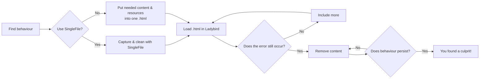

# Issues: Hunting Down Unexpected Behaviours

Browsers have an enormous number of edge cases, if you can find one, and isolate exactly where the unexpected behaviour is coming from, that can already help a lot!

That's where reduced test cases and issue raising comes in. By the end of this guide you'll know how to isolate an unexpected behaviour in a reduced test case, and you'll know where, when, and how to raise an issue.

>[!CAUTION]
> - No build issues (or other support requests). If the GitHub Actions CI build succeeds, the build problem is most likely on your side. Work it out locally, or ask in the `#build-problems` channel on Discord. Do not create an issue.
> - One bug per issue. Putting multiple things in the same issue makes both discussion and completion unnecessarily complicated.
>- Don't comment on issues just to add a joke or irrelevant commentary. Hundreds of people get notified about comments so let's keep them relevant.
>- If you can't to reduce the test case (see bellow), please go to the discord before raising an issue!

If you've been here before and you're just looking for the link to the form, [here it is](https://github.com/LadybirdBrowser/ladybird/issues/new?template=bug_report.yml).

>[!NOTE]
> The following guide assumes:
> - You have some web development knowledge (comfortable in the inspector).
> - You have followed the [getting started guide]() (ladybird is running on your device).
> - You have joined the discord server.

Ladybird developers are looking for reduced test cases; 
the simplest code that can reproduce **_just one_** unexpected behaviour. 


# How to Reduce the Test Case
Put very plainly, your aim is to keep removing things until only the source of the unexpected behaviour is left.


1. Find a behaviour on a web page in ladybird that isn't what you'd expect in Chrome/Firefox.

2. Get a .html file (eg. REDUCTION.html) containing your unexpected behaviour.

	- Often the easiest way is to open the page in Chrome/Firefox; use the [SingleFile](https://addons.mozilla.org/en-US/firefox/addon/single-file/) extension to save a canned copy of the page as it currently exists (post-JS-execution). In SingleFile you can already remove a considerable amount that probably has nothing to do with the unexpected behaviour.

	- If you aren't using something like SingleFile you may need external scripts, stylesheets, and/or anything else that rely on a relative path to reproduce the behaviour. Either: 
		- paste relevant stylesheets, svgs, scripts, etc.. directly in the html document,
		- create a local copy of the resource,
		- put a [`<base>`](https://www.w3schools.com/TAGs/tag_base.asp)element in the document like this: `<base href="https://your.webpage.url/">`


3. Verify that the behaviour still occurs by loading your `REDUCTION.html` file in Ladybird.

4. By process of elimination, you're going to find the source of the behaviour within REDUCTION.html; If the issue is in:
	- a **script**, then unchecking **Enable Scripting** option in the **Debug** menu in Ladybird would stop the behaviour.
	- a **stylesheet**, removing the rule would stop the behaviour. 
	- the **html**, removing the element would stop the behaviour.
	So just keep removing anything that doesn't stop the behaviour and eventually all you'll have left are the culprits of the one unexpected behaviour.

	To pinpoint the unexpected behaviour, it may be helpful to use the `--enable-idl-tracing` command-line flag when running Ladybird. This will output detailed information about the calls being made to the browser's internal interfaces.

```
./Meta/ladybird.py run ladybird --enable-idl-tracing
```

If you get stuck, remember there's very active community around you. Throw what you're stuck on in the discord, we're excited to learn what you've found so far!


# How to Raise the Issue
Once you've honed in your reduced test case, 
- You can share your test case at a URL using one of the following:
	- [https://codepen.io/pen/](https://codepen.io/pen/)
	- [https://jsbin.com](https://jsbin.com)
	- [https://jsfiddle.net](https://jsfiddle.net)

- Fill in [the bug-reporting form](https://github.com/LadybirdBrowser/ladybird/issues/new?template=bug_report.yml). Include your link or put the your reduced test case directly in the form's section titled "HTML/SVG/etc. source for a reduced test case".

# Examples
This might seem a little intimidating, so here are a few examples that are easy enough to follow and might serve as inspiration!

[issue #6193](https://github.com/LadybirdBrowser/ladybird/issues/6193)<br>
[issue #6085](https://github.com/LadybirdBrowser/ladybird/issues/6085)<br>
[issue #6275](https://github.com/LadybirdBrowser/ladybird/issues/6275)

# Going Further
Want to patch to your issue? 
[Getting Started Contributing]() is your friend.
